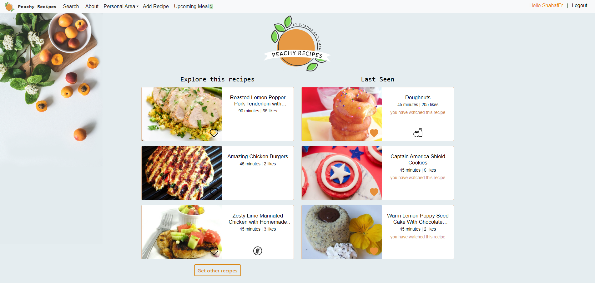
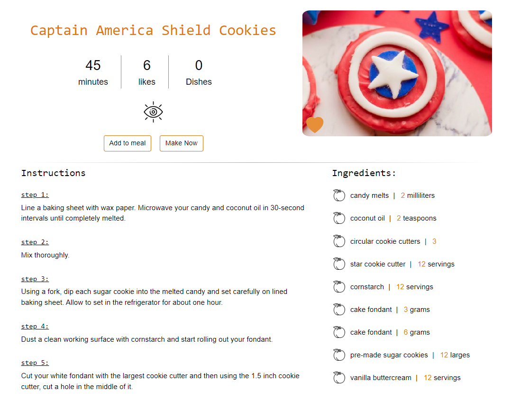
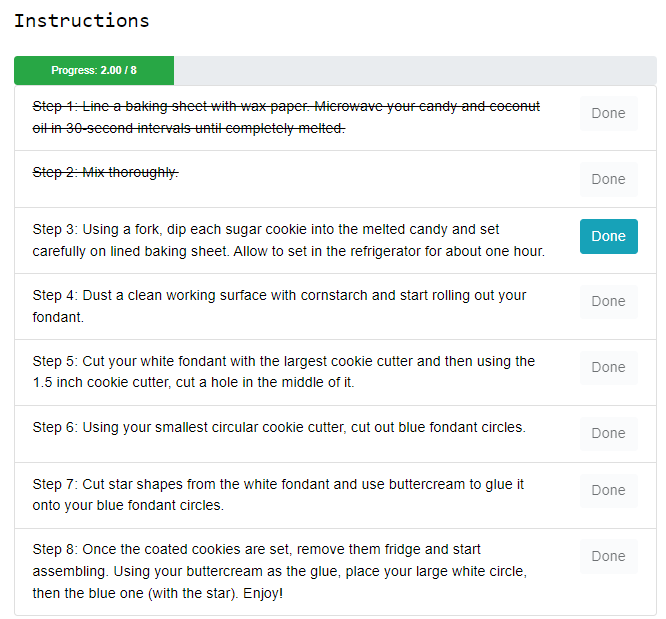
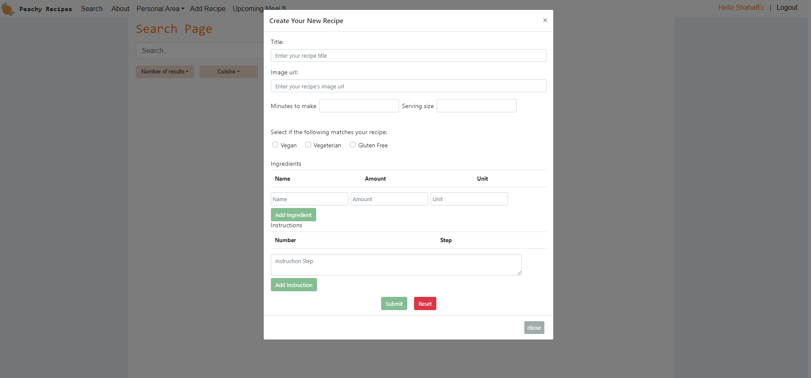

# Peachy Recipes

Peachy Recipes is a comprehensive recipe management and meal planning website that allows users to explore, manage, and plan their recipes efficiently. The project was developed as a university assignment.

## Features

- **User Authentication**: Register, login, and logout functionality to manage user accounts.
- **Explore Recipes**: Browse a variety of recipes and discover new dishes.
- **Favorites**: Save your favorite recipes for quick access.
- **Add New Recipes**: Users can contribute by adding their own recipes.
- **Search Recipes**: Find recipes using search functionality.
- **Meal Planning**: Add recipes to meal planning to organize meals for the week.
- **Recipe Progress Tracking**: Decide on the number of dishes, track recipe stages, and view a progress bar.

## Tech Stack

- **Frontend**: Vue.js
- **Backend**: Node.js with Express
- **Database**: MySQL
- **External API**: Spoonacular (for fetching recipes)

## Demo

### Main Page

### Recipe Page

### Making Recipes

### Creating New Recipe

